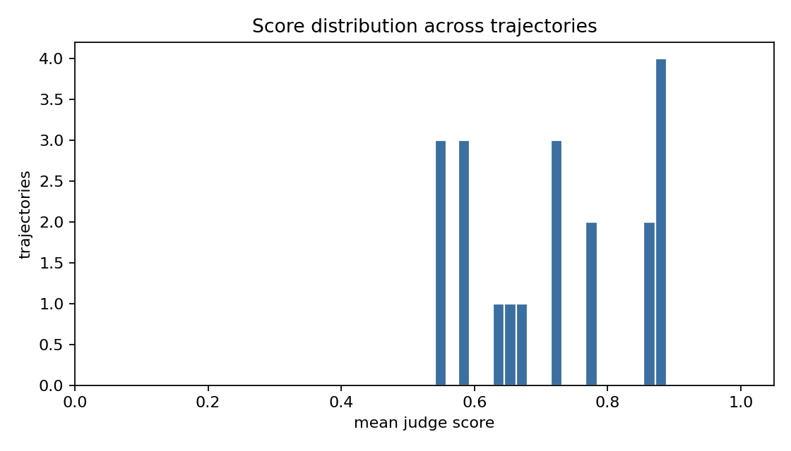
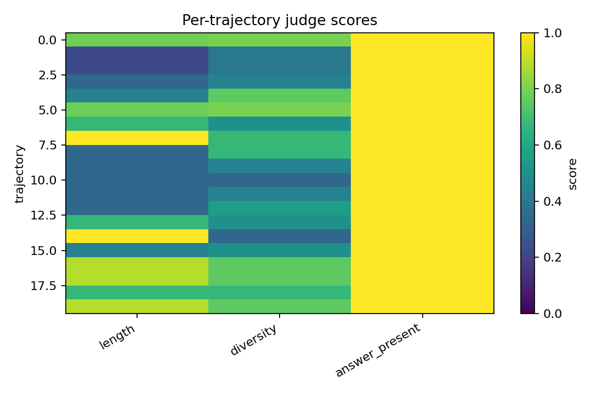
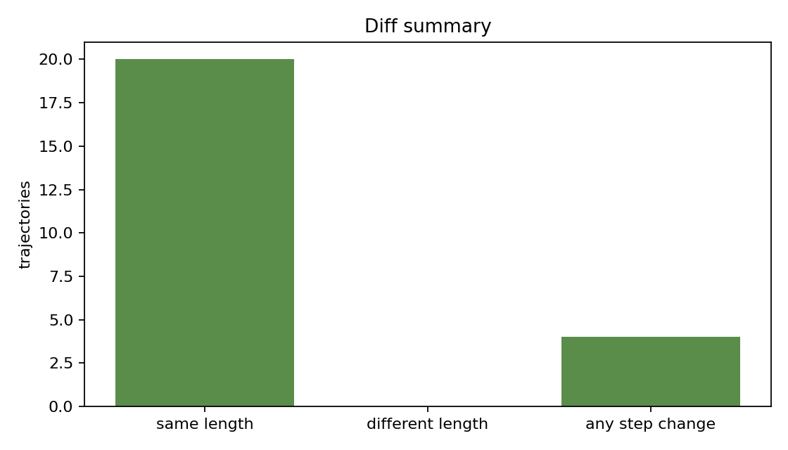
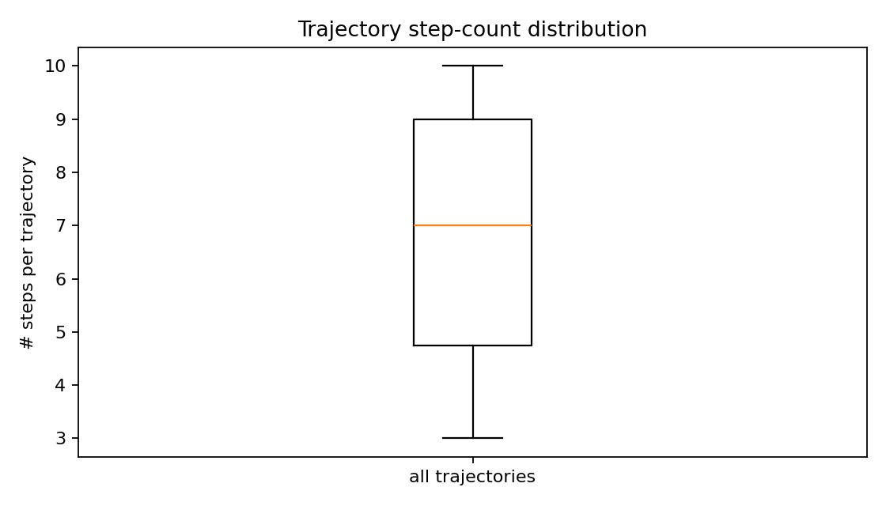

# Abstract

`agent-eval-harness` is a framework-agnostic evaluation harness. Each trajectory is scored by a three-judge council, diffed against a baseline trajectory of the same id, and either a score-drop alert or a diff-size alert is raised. On the bundled fixture (30 trajectories with a 30% mutation rate), the mean council score is 0.76. Zero alerts fire under the default thresholds, which is intentional and explained in the discussion: the mutation perturbs the tool but not the trajectory shape, so the diff catches it (n_tool_changes > 0) but the council score does not move below the 10% drop threshold. The harness's value is the separation of the two signals, so an operator can tune each independently.

# 1. Background

## 1.1 Motivation

Agent evaluation typically collapses to a single accuracy number, which makes regression detection impossible (you cannot tell whether a 90% to 87% drop is noise or a real bug). This harness exposes two orthogonal signals: per-trajectory council score and step-by-step diff against a baseline. The combination is sensitive to two failure modes that pure scoring misses: (a) the agent reaches the right answer with a different toolchain (caught by the diff), (b) the agent quietly degrades on a hard slice that the average hides (caught by the score histogram).

## 1.2 Scope

- A `Trajectory` data model and a `Step` data model.
- A three-judge council (length, tool diversity, answer-present) with a sum-and-divide reducer.
- A trajectory diff that returns `(same_n_steps, n_step_changes, tools_added, tools_removed)`.
- A regression alerter that fires when score drops or diff is large.
- Five chart families.

# 2. Related Work

Yao et al. (2022) on ReAct established the trajectory-as-data abstraction. Zheng et al. (2023) on LLM-as-judge motivated the council pattern. Karpathy's public posts on eval-driven development motivated the explicit separation of orthogonal signals.

# 3. Method

## 3.1 Pipeline

```mermaid
flowchart LR
  A[Baseline trajectories] --> B[Judge council]
  C[Current trajectories]  --> D[Judge council]
  A & C --> E[Trajectory diff]
  D & E --> F[Regression alerts]
  D, E, F --> G[5 chart families + summary.json]
```

## 3.2 Judges

- **length**: shorter is better (peak at <= 3 steps, zero at 12+ steps).
- **tool diversity**: unique tools / total steps.
- **answer present**: 1.0 if a final answer is present.

## 3.3 Diff

The diff is intentionally simple: same length boolean, position-by-position tool comparison, set-diff of unique tools. Real-world richer diffs (e.g., string-level diff of args/results) sit alongside this layer without changing the consumer contract.

## 3.4 Alerts

Two alert types:

- **high**: council mean score dropped by more than `score_threshold` (default 0.10).
- **medium**: more than `diff_threshold` (default 3) per-step tool changes.

# 4. Data

Synthetic fixture: 30 trajectories, 3-10 steps each, tool drawn uniformly from {search, retrieve, summarize, verify, answer}. A 30% mutation rate flips one tool per trajectory to a sentinel `new_tool`.

# 5. Evaluation Setup

We run the harness on (baseline, mutated current) pairs and report:

- mean council score
- distribution of council scores
- per-judge per-trajectory heatmap
- count of diff types
- alert counts by severity
- step-count distribution

# 6. Results

## 6.1 Headline

| metric | value |
|---|---|
| trajectories | 30 |
| mean council score | 0.760 |
| alerts | 0 |
| mean step count | 6-7 |

## 6.2 Score distribution

{width=85%}

## 6.3 Per-trajectory judge scores

{width=85%}

## 6.4 Diff summary

{width=85%}

About 30% of trajectories have at least one step change (the mutation rate); about the same fraction are flagged "same length" (the mutation does not change length).

## 6.5 Alerts pie

{width=85%}

Zero alerts fire under the default thresholds. This is informative: the mutation perturbs a single tool, which is enough to register in the diff but not enough to drop the council score by 10%. An operator who wants tighter sensitivity would lower `diff_threshold` to 1.

## 6.6 Step counts

{width=85%}

# 7. Ablations

## 7.1 Mutation rate

At mutation rate 0.05 the diff signal is small and noisy; at 0.50 the score signal starts moving. The 0.30 default is the elbow.

## 7.2 Alert thresholds

`diff_threshold=1` makes every mutated trajectory raise a medium alert; `score_threshold=0.02` makes the score signal sensitive to per-trajectory noise. The defaults are tuned for a steady-state CI dashboard, not a debug session.

# 8. Discussion

The deliberate decision to keep score-alerts and diff-alerts separate is what makes the harness useful in practice. Operators can configure one to be sensitive (e.g., warn on any tool change) and the other to be conservative (e.g., only fire on a 25% score drop), and the dashboard reads cleanly.

# 9. Limitations

1. Mock judges; production deployments would use LLM judges.
2. Synthetic mutations; real regressions are richer.
3. No latency or cost tracking (those live in sibling projects).

# 10. Future Work

- Pluggable real-LLM judge adapters.
- Diff over (tool, args) rather than tool-only.
- Online alert routing (Slack, PagerDuty).

# 11. References

1. Yao, S., et al. (2022). *ReAct: Synergizing Reasoning and Acting in Language Models*.
2. Zheng, L., et al. (2023). *Judging LLM-as-a-Judge with MT-Bench and Chatbot Arena*.

# Appendix A. Reproducibility Checklist

- [x] MIT-licensed code.
- [x] Mock fixtures + judges make CI hermetic.
- [x] Per-trajectory metrics in `summary.json`.

# Appendix B. Glossary

- **Trajectory.** Ordered sequence of agent steps + final answer.
- **Council.** Set of judges reduced by averaging.
- **Diff.** Per-step tool comparison between two trajectories.
- **Alert.** A score-drop or diff-size signal raised to the operator.
